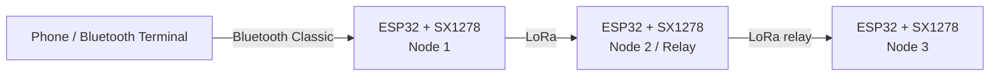

# Multi-Hop LoRa Communication System

A **team project for the Information Theory course** implementing a three-node LoRa communication network with ESP32 and SX1278 modules.

This repository is a cleaned and documented portfolio version of the original team repository:

**Original team repository:** https://github.com/meochuoi2k6/lora-multi-hops

> The current network uses **controlled flooding** for multi-hop forwarding. It is not a full dynamic mesh-routing implementation such as AODV.

---

## 1. System Overview

Each node uses the same firmware and receives a different `NODE_ID` at build time.



Main processing pipeline:

```text
Bluetooth / text input
        ↓
Entropy calculation
        ↓
Static Huffman compression when beneficial
        ↓
Fragmentation into ≤ 64-byte payloads
        ↓
Custom LoRa packet format
        ↓
Controlled flooding + TTL + deduplication
        ↓
Destination reassembly
        ↓
Huffman decompression
        ↓
Bluetooth / Serial output
```

---

## 2. Hardware and Radio Configuration

### Hardware

- ESP32 development board
- LoRa Ra-02 / SX1278 module
- SPI communication between ESP32 and LoRa
- Bluetooth Classic on ESP32 for local user input/output

### Current source configuration

| Parameter | Value |
|---|---:|
| LoRa frequency | 433 MHz |
| Spreading Factor | SF7 |
| Bandwidth | 125 kHz |
| Coding Rate | 4/5 |
| Sync Word | `0x12` |
| Preamble | 8 symbols |
| TX power | 17 dBm |
| Hardware CRC | Enabled |

The source currently defines the SPI/LoRa pins in `include/lora_setup.h`.

> **Hardware note:** the current source defines `DIO0_PIN = 2`, while the team report lists GPIO26 for DIO0. Verify the actual wiring before flashing. See `docs/KNOWN_NOTES.md`.

---

## 3. Custom Packet Protocol

The application layer defines a packed `LoRaPacket` containing fields such as:

- protocol version
- packet type
- source and destination IDs
- previous and next hop
- sequence number
- message ID
- fragment index / fragment count
- TTL
- flags
- payload codec
- original length / encoded bit length
- payload length
- payload up to 64 bytes

Maximum source message size is approximately **1 KB**.

The smaller 64-byte application payload is intentional: it reduces airtime per packet and makes fragmentation/retry behavior easier to manage.

---

## 4. Multi-Hop Forwarding

The current implementation uses **controlled flooding**.

For forwarding:

- `get_next_hop()` returns `BROADCAST_ID`
- each packet carries a TTL
- relay nodes decrement TTL before forwarding
- recently seen packets are identified by `(src, seq)`
- duplicate packets are dropped
- a circular seen-packet cache helps limit repeated flooding

This design is simple and suitable for a small three-node experimental network, although it produces more overhead than a route-discovery protocol.

---

## 5. Reliability Mechanisms

### End-to-end ACK and retry

For unicast traffic:

- the destination sends the ACK
- relay nodes do **not** ACK data packets
- ACK packets can themselves be flooded back through the network
- timeout: **5 s**
- maximum retry count: **3**

Broadcast traffic disables ACK requests to avoid an ACK storm.

### RX/TX buffering

The implementation contains:

- TX message queue
- RX packet queue
- multiple message-reassembly buffers
- fragment tracking
- receive-buffer timeout handling

### Collision reduction

The project uses a CSMA/CA-like strategy based on:

- physical RSSI carrier sensing
- RX activity checking
- random backoff / jitter
- wider relay delay to reduce simultaneous forwarding

This is a custom application-level collision-reduction strategy rather than a standards-compliant MAC implementation.

---

## 6. Source Coding — Static Huffman

The project applies concepts from Information Theory by calculating source entropy and attempting **Static Huffman** compression.

A fixed ASCII frequency model is shared by all nodes, so a codebook does not need to be transmitted with every message.

The cleaned version uses compressed data only when the compressed size is at most **80% of the raw size**.

Examples reported by the team:

| Test message | Raw | Encoded | Ratio | Behavior |
|---|---:|---:|---:|---|
| `Hello World` | 11 B | 8 B | 0.727 | Huffman used |
| Repetitive `A/B/C` string | 15 B | 6 B | 0.400 | Huffman used |
| Vietnamese UTF-8 sample | 38 B | 38 B | 1.000 | Raw fallback |
| Rare-letter sample | 14 B | 14 B | 1.000 | Raw fallback |

The current Huffman table supports basic 7-bit ASCII. UTF-8 characters outside this range fall back to raw transmission.

---

## 7. Experimental Results from the Team Report

These values are **reported measurements from the original team experiments**, not guarantees for other hardware or environments.

### Indoor / obstacle tests

- through one wall: approximately **RSSI -63 dBm, SNR 10.0 dB**
- floor 2 to floor 5: approximately **RSSI -77 dBm, SNR 9.8 dB**

### Distance test

From 10 m to 100 m:

- RSSI decreased from about **-63 dBm to -90 dBm**
- at 100 m, SNR was approximately **-5.7 dB**
- the report records **11/11 packets received** in all four tested distance scenarios

### Broadcast-storm experiment

The team report compares transmission with and without the queue/backoff mechanism.

With RX queue + carrier sensing/backoff enabled, the reported experiment received all message fragments and recorded:

```text
Packet loss: 0%
```

This result applies only to that specific test setup.

### RTT

Reported round-trip time:

- direct one-hop: approximately **163–168 ms**
- two-hop with a relay at the tested 200 m setup: approximately **800–1200 ms**

The extra multi-hop delay comes from relay processing, deduplication and intentional random backoff.

---

## 8. Project Structure

```text
multi-hop-lora-communication/
├── include/
│   ├── bluetooth_input.h
│   ├── lora_packet.h
│   ├── lora_setup.h
│   └── static_huffman.h
├── src/
│   ├── bluetooth_input.cpp
│   ├── lora_packet.cpp
│   ├── lora_setup.cpp
│   ├── main.cpp
│   └── static_huffman.cpp
├── docs/
│   ├── team_report.pdf
│   └── KNOWN_NOTES.md
├── assets/
│   └── README.md
├── platformio.ini
├── .gitignore
├── .gitattributes
└── README.md
```

---

## 9. Build with PlatformIO

### Requirements

- VS Code
- PlatformIO extension / PlatformIO Core
- ESP32 board
- SX1278 / Ra-02 LoRa module

The LoRa dependency is downloaded automatically:

```ini
sandeepmistry/LoRa@^0.8.0
```

### Build one node

```bash
pio run -e node1
```

or:

```bash
pio run -e node2
pio run -e node3
```

### Upload

Connect the target ESP32 and run:

```bash
pio run -e node1 -t upload
```

If PlatformIO cannot choose the correct serial port automatically, specify the port locally rather than committing a machine-specific COM port to the repository.

### Serial monitor

```bash
pio device monitor -b 115200
```

---

## 10. Node IDs

The three environments use compile-time flags:

```text
node1 -> NODE_ID=1
node2 -> NODE_ID=2
node3 -> NODE_ID=3
```

All nodes use the same source code.

---

## 11. Important Portfolio Fixes

This cleaned version makes a few targeted corrections without redesigning the original team project:

1. **Compression threshold bug fixed**

   The old code converted the floating-point compression ratio to `int`, which caused values such as `0.90` to become `0` and incorrectly satisfy the `<= 0.80` condition.

2. **Fragment counter cleanup**

   Removed an incorrect `txFragments++` inside the raw radio-send failure path. Message-level DATA fragment statistics remain managed by `lora_send_text_internal()`.

3. **Portable PlatformIO configuration**

   Removed hard-coded COM ports from `platformio.ini`.

4. **Repository cleanup**

   Removed IDE-generated files, extracted-report text, assignment criteria and the duplicated LoRa library/submodule from this portfolio copy.

5. **Terminology clarified**

   Documentation describes the current forwarding algorithm as **controlled flooding** instead of claiming a complete dynamic mesh-routing protocol.

For additional notes, see `docs/KNOWN_NOTES.md`.

---

## 12. Current Limitations

- fixed three-node experimental setup
- controlled flooding increases airtime as the network grows
- no dynamic route discovery or routing table
- Static Huffman only supports the configured ASCII symbol set
- unicast ACK/retry increases latency in multi-hop scenarios
- radio performance depends heavily on antennas, placement, interference and environment
- current source/report contain a DIO0 pin discrepancy that should be verified against the real hardware
- software CRC16-CCITT described in the report is not present in this source version; hardware LoRa CRC is enabled

---

## 13. Future Work

Possible extensions include:

- route discovery such as AODV-like routing
- adaptive routing based on RSSI/SNR
- better congestion control
- systematic packet-loss / throughput benchmarking
- persistent topology monitoring
- encryption / authentication
- dynamic or broader-character source coding
- sensor-data integration
- gateway and dashboard integration

---

## 14. Academic Context and Attribution

This is a **team project** developed for an Information Theory course.

The code in this repository is a cleaned portfolio copy based on the team's original source. The original repository remains available at:

https://github.com/meochuoi2k6/lora-multi-hops

The original team report is preserved in `docs/team_report.pdf`.
